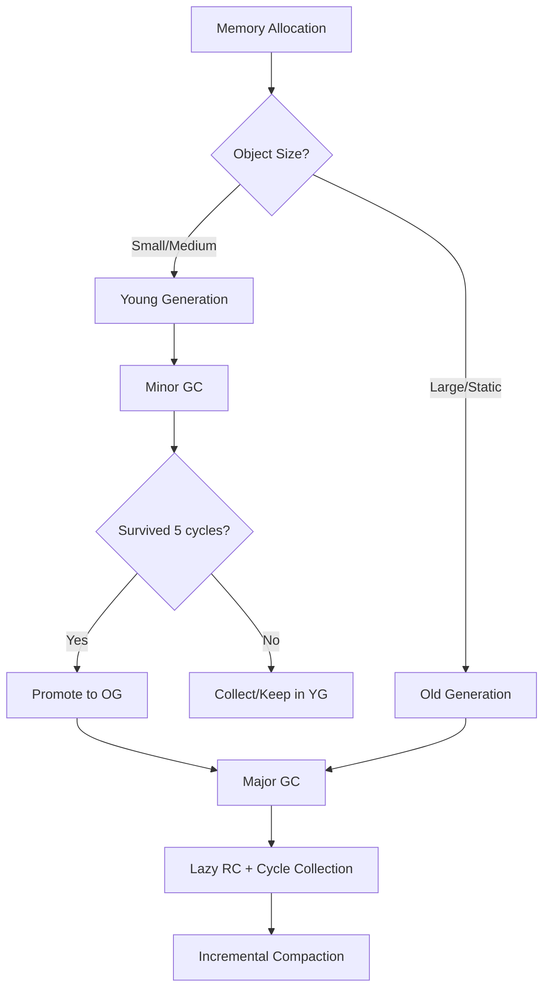

# Celeris Compiler Specification

## 1. Overview

Language for Celeris designed to be read by **CSAOT**.

---

## 2. Lexical Structure

### 2.1 Whitespace

Whitespace characters (spaces, tabs, newlines) are used to separate tokens and improve readability. They are generally ignored except when separating tokens.

### 2.2 Comments

Comments are ignored by the compiler and can be single-line or multi-line.

#### 2.2.1 Single-line Comments
Start with `//` and continue to the end of the line.

```go
// This is a single-line comment
```

#### 2.2.2 Multi-line Comments
Enclosed between `/*` and `*/`.

```go
/* This is a
     multi-line comment */
```

```go
/*
 * This is a
 * multi-line comment
 */
```

#### 2.2.3 Documentation Comments

```go
/**
 * This is a documentation comment.
 */
```

### 2.3 Identifiers

Identifiers are names for variables, functions, classes, etc. They must start with a letter (A-Z, a-z) or underscore (`_`), followed by letters, digits (0-9), or underscores.

### 2.4 Nomenclature Standards

#### 2.4.1 Packages
Package names must be singular, in lowercase. In case for composed packages, you can both keep it all in lowercase, or use an underscore. Anyway, it is recommended to use non composed names for packages. If the package name begins with a digit or any other illegal character, the suggested convention is to add an underscore aswell.

**Example:** `mathutility` or `math_utility`
**Underscore Example:** `_2025exercise`

#### 2.4.2 Classes
Class names must start with an uppercase letter, be singular, and not exceed three words.

**Example:** `UserProfile`

#### 2.4.3 Functions
Function names must be in camelCase, start with a lowercase letter, and use descriptive verbs.

**Example:** `calculateTriangleArea`

#### 2.4.4 Variables
Variable names must be in camelCase, start with a lowercase letter, and be descriptive. Avoid abbreviations unless widely recognized.

**Examples:** `userAge`, `totalAmount`

### 2.5 Literals

Literals represent fixed values in the source code:

- **Integer literals:** `42`, `-7`
- **Byte literals:** `0xFF`, `255`, `b'Z'`
- **Long literals:** `1234567890123L`, `-9876543210L`
- **Floating-point literals:** `3.14`, `-0.001`, `4F`
- **Double literals:** `3.14159D`, `-2.71828D`
- **Character literals:** `'A'`, `'9'`
- **SliceChar literals:** `"Hello, World!"`
- **Boolean literals:** `true`, `false`
- **Null literal:** `null`

#### 2.5.1 Integer Literals

An Integer can be written as `10`, `0`, `-1`, being interpreted by default a `Int<32>`.

```go
var a = 10          // By default: Int<32>
var b : Int<8> = 5  // 5 Integer of 8 bits
var c : Int<64> = 5 // 5 Integer of 64 bits
```

### 2.6 Operators, Symbols and Delimiters

| Symbol | Explanation |
|--------|-------------|
| `[ ]` | Array declaration and indexing |
| `{ }` | Delimiters for functions, classes, and code blocks |
| `+` | Addition operator |
| `-` | Subtraction operator |
| `*` | Multiplication operator |
| `/` | Division operator |
| `%` | Modulo operator |
| `=` | Assignment operator |
| `++` | Increment operator |
| `--` | Decrement operator |
| `&&` | Logical AND operator |
| `\|\|` | Logical OR operator |
| `!` | Logical NOT operator |
| `&` | Bitwise AND operator |
| `\|` | Bitwise OR operator |
| `^` | Bitwise XOR operator |
| `~` | Bitwise NOT operator |
| `<<` | Bitwise left shift |
| `>>` | Bitwise right shift |
| `==` | Equality comparison |
| `!=` | Inequality comparison |
| `<` | Less than comparison |
| `>` | Greater than comparison |
| `<=` | Less than or equal comparison |
| `>=` | Greater than or equal comparison |
| `.` | Member access or function call |
| `,` | Separator for arguments or elements |
| `;` | Statement terminator (Optional for inline) |
| `:` | Type annotation or label |
| `()` | Function call or grouping expressions |
| `$variable` | Used for string interpolation within SliceChar literals |

### 2.7 Keywords

#### 2.7.1 Conditional Words

| Keyword | Explanation |
|---------|-------------|
| `IF` | Conditional statement |
| `ELSE` | Alternative conditional branch |
| `ELSE IF` | Conditional "else if" branch |
| `SWITCH` | Multi-branch selection |
| `CASE` | Case in a switch |
| `DEFAULT` | Specifies default case in switch statements |

#### 2.7.2 Flow Control Words

| Keyword | Explanation |
|---------|-------------|
| `DO` | Do-while loop |
| `WHILE` | While loop |
| `FOR` | For loop |
| `BREAK` | Exit loop or switch |
| `CONTINUE` | Skip to next iteration of loop |
| `RETURN` | Return from function |
| `DELETE` | Manual memory deallocation |
| `NEW` | Manual memory allocation (object/instance creation) |

#### 2.7.3 Error Handling Words

| Keyword | Explanation |
|---------|-------------|
| `TRY` | Start of exception handling |
| `CATCH` | Exception handling block |
| `FINALLY` | Block executed after try/catch |
| `THROW` | Raise an exception |
| `THROWS` | Declare exceptions a function can raise |

#### 2.7.4 Encapsulation Words

| Keyword | Explanation |
|---------|-------------|
| `PRIVATE` | Private access modifier |
| `PROTECTED` | Protected access modifier |
| `PUBLIC` | Public access modifier |
| `INTERNAL` | Compilation access modifier, only allows access from the same program |

#### 2.7.5 Inheritance Words

| Keyword | Explanation |
|---------|-------------|
| `ENUM` | Enumeration type |
| `CLASS` | Class declaration |
| `INTERFACE` | Interface declaration |
| `:` or `IMPLEMENTS` | Indicates a class implements an interface or class |
| `INSTANCEOF` | Checks type of an object |
| `STATIC` | Static member of a file |
| `SUPER` | Access parent class functions or constructor |
| `THIS` | Reference to the current instance |

#### 2.7.6 Miscellaneous Keywords

| Keyword | Explanation |
|---------|-------------|
| `CONST` | Constant value declaration |
| `PACKAGE` | Package declaration |
| `USING` | Import or include another package/module |
| `AS` | Used to rename an imported class or package for easier reference |
| `TRUE` | Boolean true value |
| `FALSE` | Boolean false value |
| `NULL` | Null reference |
| `SIZEOF` | Returns the size in bytes of a data type or variable |
| `VAR` | Declares a variable with inferred or explicit type |
| `ESCAPE` | Storage modifier that instructs the compiler to allocate an object directly in the heap, bypassing escape analysis |
| Data Types | Any data type is a keyword |

### 2.8 Escape Sequences

String and character literals support escape sequences such as `\n` (newline), `\t` (tab), `\\` (backslash), `\'` (single quote), and `\"` (double quote) `\$` ($).

---

## 3. Type System

Celeris supports a variety of built-in types and allows for user-defined types.

### 3.1 Primitive Types

| Type | Explanation | Size | Range |
|------|-------------|------|-------|
| `Bool` | Boolean type (true/false) | 1 byte | `true` / `false` |
| `Char` | A single character | 1 byte | 0 to 255 |
| `SliceChar` | An array of mutable chars. Length can't change but content is mutable | variable (Default 255 Chars) | Depends on length |
| `Int<T>` | Integer type of a number. You can specify the bytes this Integer will have. By default 32. If an overflow or underflow occurs, a compilation error will be thrown. | 4 bytes | -2,147,483,648 to 2,147,483,647 |
| `Byte` | Smallest data type | 1 byte | 0 to 255 |
| `Short` | Small integer | 2 bytes | -32,768 to 32,767 |
| `Long` | Large integer | 8 bytes | -9,223,372,036,854,775,808 to 9,223,372,036,854,775,807 |
| `Float` | Single precision floating point | 4 bytes | ±1.18×10⁻³⁸ to ±3.4×10³⁸ |
| `Double` | Double precision floating point | 8 bytes | ±2.22×10⁻³⁰⁸ to ±1.79×10³⁰⁸ |

### 3.2 Composite Types

#### 3.2.1 Arrays
Arrays are fixed-size and mutable, non-ordered collections of elements of the same type.

```go
var numbers : Int[5] = [1, 2, 3, 4, 5]
```

#### 3.2.2 Slices
Slices are fixed-sized and mutable sequences of elements. `SliceChar` is a built-in slice type for characters.

```go
var message : SliceChar = "Hello, World!"
```

### 3.3 Default Values

When a variable is declared but not explicitly initialized, it is assigned a default value based on its type:

| Type | Default Value |
|------|---------------|
| `Bool` | `false` |
| `Char` | `''` |
| `SliceChar` | `""` (empty string) |
| `Int` | `0` |
| `Byte` | `0` |
| `Short` | `0` |
| `Long` | `0L` |
| `Float` | `0.0F` |
| `Double` | `0.0D` |
| Object/Class | `null` |
| Array | `null` |

#### Example

```go
var flag : Bool         // flag is false
var count : Int         // count is 0
var name : SliceChar    // name is ""
var user : UserProfile  // user is null
```

### 3.4 Generics and Type Parameters

Generics are commonly used with collections, custom data structures, and utility functions. For example, `List<T>` can store elements of any type, and functions can accept or return generic types.

Generic type parameters are resolved at compile time, ensuring type correctness and performance. You can also use type constraints to require that a type parameter implements an interface or inherits from a base class.

Generics support multiple type parameters, allowing complex relationships between types. This feature is essential for building flexible APIs and reusable components.

#### 3.4.1 Generic Type Declaration

You must declare generic on the class or function declaration. Unless you do it, you won't be able to use generic on your class.

```go
class Container<T> {        // This is valid
    public var value : T 

    Container(initialValue : T) {
        this.value = initialValue
    }
}

class Container {           // This is invalid
    var value : T

    Container(initialValue : T) {
        this.value = initialValue
    }
}

class Utility {
    public static func findMax<T : Number> (a : T, b : T) (T) { // This is valid
        return a > b ? a : b
    }
}

class MathUtility<T : Number> {
    public static func findMax(a : T, b : T) (T) {              // This is valid
        return a > b ? a : b
    }
}
```

#### 3.4.2 Generic Functions

You can use Generics inside functions, as parameter or return value.

```go
class MathUtility<T : Number> {

    public static func findMax(a : T, b : T) (T) {
        return a > b ? a : b
    }
}
```

#### 3.4.3 Type Constraints

You can specify generic type constraints to restrict the types that can be used as type parameters. By default, `<T>` allows any type, but you can use syntax like `<T : Animal>` to indicate that `T` must be `Animal` or inherit from `Animal`. This enables compile-time filtering and ensures type safety for generic classes and functions.

**Example:**

```go
class PetShelter<T : Animal> {
    var animals : List<T>
}
```

#### 3.4.4 Multiple Type Parameters

You can declare multiple generic type parameters by separating them with commas in angle brackets. This allows classes and functions to work with several types simultaneously.

```go
class Pair<K, V> {
    var key : K
    var value : V

    Pair(key : K, value : V) {
        this.key = key
        this.value = value
    }
}

class Repository<T : Entity, ID : Identifier> {
    func findById(id : ID) : (T) {
        // Implementation
    }
}

func swap<A, B>(a : A, b : B) : (B, A) {
    return b, a
}
```

### 3.5 Nullably Types

Nullable types allow a variable to hold either a value of the specified type or `null`.

#### 3.5.1 Nullable Type Declaration

They are declared by adding a question mark `?` to the type:

```go
var varName : <Type>? = null
```

`varName` can be of type `<Type>` or `null`. If the `?` is not included, the variable can never be `null` and the compiler will emit an error if you try to assign `null`.

#### 3.5.2 Null Checking

To check if a value is null, use the `null` keyword in a conditional expression:

```go
func processUser(user : User?) {
    if (user != null) {
        print("Processing user: $user.name")
    } else {
        print("No user to process")
    }
}
```

This pattern ensures safe access to properties or methods only when the variable is not null.

#### 3.5.3 Safe Navigation Operator

The safe navigation operator `?.` allows you to access properties or methods of an object only if it is not `null`. If the object is `null`, the entire expression evaluates to `null` without throwing an error.

**Syntax:**

```go
var result = user?.name
```

This is equivalent to:

```go
if (user == null) {
    return null
} else {
    return user.name
}
```

You can chain safe navigation operators for nested objects:

```go
var name = entity?.data?.name
```

This returns `null` if any part of the chain (`entity`, `data`, or `name`) is `null`.

> **Note:** The safe navigation operator improves code readability and reduces the need for explicit null checks.

#### 3.5.4 Null Coalescing Operator

The null coalescing operator `??` allows you to provide a default value when an expression evaluates to `null`. It is commonly used with nullable types and safe navigation.

**Syntax:**

```go
var displayName = user?.name ?? "Unknown"
```

This is equivalent to:

```go
var name = user == null ? null : user.name
displayName = name == null ? "Unknown" : name
```

The operator checks if the left-hand side is `null`; if so, it returns the right-hand side value. Otherwise, it returns the left-hand side value.

> **Note:** The null coalescing operator simplifies code by reducing explicit null checks and providing fallback values in a single expression.

#### 3.5.5 Null Coalescing Assignment Operator

Celeris also supports the null coalescing assignment operator ??=. This operator assigns the right-hand side value to the variable only if the variable is currently null.

**Sintax:**

```go
userName ??= "Guest"
```

This is equivalent to:

```go
if (userName == null) {
    userName = "Guest"
}
```

> **Note:** The `??=` operator simplifies code by combining a null check and assignment into a single concise expression.


---

## 4. Language Usage

### 4.1 Variables / Properties

Variables in Celeris are declared using the `var` keyword, followed by the variable name and an optional type annotation.

#### 4.1.1 Syntax

```go
[internal] [visibility] var <variableName> : <Type?>
```

- `[internal]`: Optional. Limits function access to the same program. You can only use this on properties, not variables. 
- `[visibility]`: Optional. Can be `private`, `protected`, or `public` (defaults to `public`). You can only use this on properties, not variables. 
- `var` is the keyword for variable declaration
- `variableName` is the identifier for the variable (must be unique in context)
- `Type` is the data type of the variable (can be infered if initialized)

##### Examples

```go

var age : Int
var name : SliceChar
var isActive : Bool
```

#### 4.1.2 Scope

The scope of variables in Celeris is always local to the block in which they are declared. If a variable is defined inside a function, it is only accessible within that function. Class member variables have class-level scope, meaning they can be accessed from anywhere you have a reference to the class instance.

Static variables have global scope within the program, provided their visibility allows access. Static members can be accessed without creating an instance of the class, and their lifetime is tied to the program execution.

The `internal` modifier restricts scope to within the same compilation program. Members marked as `internal` are only accessible from code that is part of the same compiled program, and not from external libraries or modules.

#### 4.1.3 Initialization

Initialize a variable at declaration using the assignment operator `=`:

```go
var age : Int = 25
var name : SliceChar = "Alice"
var isActive : Bool = true
```

You can also declare and initialize arrays and objects:

```go
var numbers : Int[] = [1, 2, 3]
var user : UserProfile = UserProfile()
```

#### 4.1.4 Multiple Assignment

Celeris supports multiple assignment, allowing you to assign values to several variables simultaneously:

```go
var a, b, c = 1, 2, 3
// a = 1, b = 2, c = 3
```

Or

```go
var a = 1, b = 2, c = 3
```

This feature is useful when unpacking values from functions that return multiple results:

```go
func getUserInfo() : (SliceChar, Int, Bool) {
    return "Bob", 30, true
}

var name, age, isActive = getUserInfo()
// name = "Bob", age = 30, isActive = true
```

#### 4.1.5 Type Inference

Celeris supports type inference, allowing the compiler to automatically deduce the type of a variable from its initializer:

```go
var inferred = 42        // Type inferred as Int
var message = "Hello"    // Type inferred as SliceChar
var flag = true          // Type inferred as Bool
```

> **Note:** If a variable is declared without an initializer, type inference cannot be applied. In such cases, an explicit type annotation is required.

```go
var value           // Invalid: type cannot be inferred
var value : Int     // Valid: explicit type annotation
```

### 4.2 Constants and Static

#### 4.2.1 Constants

Constants are declared using the `const` keyword. A constant is read-only and its value cannot be changed after initialization.

```go
const PI : Double = 3.14159D
const greeting : SliceChar = "Hello"
```

#### 4.2.2 Static Variables and Functions

The `static` keyword is used to declare variables or functions that belong to the class itself rather than to any instance. Static members can be accessed without creating an instance of the class.

```go
class MathUtils {
    static var counter : Int = 0

    static func increment() {
        counter = counter + 1
    }
}
```

#### 4.2.3 Combining `const` and `static`

You can use both `const` and `static` together to declare class-level constants:

```go
class Config {
    static const MAX_USERS : Int = 100
}
```

### 4.3 Functions

Functions are declared using the `func` keyword:

#### 4.3.1 Syntax

```go
[internal] [visibility] [abstract] [static] func functionName(param1 : Type1, param2 : Type2, ...) : (ReturnType) {
    // function body
}
```

```go
// Public static function with parameters and return value
public static func sum(a : Int, b : Int) : (Int) {
    return a + b
}

// Internal public function with parameters, no return value
internal public func execute(task : Task) {
    print("Executing task: $task.name")
}

// Private function with no parameters or return value
func initialize() {
    // Perform initialization logic here
}

// Abstract function in a class or interface (no body)
abstract func calculateArea() : (Double)
```

#### 4.3.2 Function Declaration Modifiers

- `[internal]`: Optional. Limits function access to the same program.
- `[visibility]`: Optional. Can be `private`, `protected`, or `public` (defaults to `public`).
- `[abstract]`: Optional. Declares that this function can be accessed without initializing the class it belongs to.
- `[static]`: Optional. Declares a class-level function.

#### 4.3.3 Function Declaration Components

- **functionName**: Required. Must follow camelCase.
- **Parameters**: Each parameter defined as `paramName : Type`, separated by commas.
- **ReturnType**: Optional. Specify in parentheses after the colon. Use `void` or omit if no return value. You can have as many return values as wanted.
- **Function Body**: Enclosed in curly braces `{}`.

#### 4.3.4 Returning Values

To return values from a function, use the `return` keyword followed by the value(s) to be returned. If the function specifies multiple return types, separate the returned values with commas.

```go
func add(a : Int, b : Int) : (Int) {
    return a + b
}

func getCoordinates() : (Int, Int) {
    return 10, 20
}
```

If the function does not return a value, omit the `return` statement or use `return` without arguments.

```go
func logMessage(message : SliceChar) {
    print(message)
    return
}

func logMessage(message : SliceChar) {
    print(message)
}
```

#### 4.3.5 Unreachable Code Detection

If a function contains a mandatory `return` statement and unreachable code follows it, the compiler will allow compilation but will emit a warning indicating the presence of unreachable code. Unlike languages such as Golang, which treat unreachable code after a required return as a compilation error, Celeris permits it but highlights the issue to the developer during compilation.

```go
func foo() : (Int) {
    return 42
    print("This code is unreachable") // Warning: unreachable code
}
```

> **Note:** While the code compiles, it is recommended to remove unreachable statements to maintain code clarity and avoid potential logic errors.


### 4.4 Expressions

Expressions in Celeris are combinations of literals, variables, operators, and function calls that evaluate to a value.

##### Examples

```go
var sum = a + b * 2
var isAdult = age >= 18 && isActive
var message = "Hello, " + name
var result = calculateArea(width, height)
```

#### 4.4.1 String Interpolation

SliceChar literals support string interpolation using `$variable` syntax:

```go
var greeting = "Hello, $userName!"
```

#### 4.4.2 String Mutability

`SliceChar` is a mutable string type with a fixed initial size that can be changed dynamically. This means its contents can be modified (characters replaced, appended, or removed), but its mutability is limited by the current allocated size. Expanding or shrinking requires resizing the underlying storage.

#### 4.4.3 Function Calls

Functions can be called within expressions:

```go
var area = getWidth() * getHeight()
```

#### 4.4.4 Conditional Expressions

Celeris supports conditional (ternary-like) expressions:

```go
var status = isActive ? "Active" : "Inactive"
```

#### 4.4.5 Assignment Expressions

Assignment is also an expression and can be chained:

```go
var x = y = z = 0
```

#### 4.4.6 Type Casting

##### 4.4.6.1 Explicit Casting

Explicit type casting is often used when implicit casting is not possible. This typically occurs when converting between types where information may be lost. For example, casting from `Int<8>` to `Int<2>` results in the loss of 252 possible values, or casting from `Float` to `Int` discards the decimal part.

Explicit casting is also required when converting objects between types, such as casting a `Pet` object to a `Dog` object.

```go
var smallInt : Int<8> = 100
var largeInt : Int<32> = ((Int<32>) smallInt)    // Explicit cast

var floatValue : Float = 3.75F
var intValue : Int = ((Int) floatValue)          // Casts to Int, decimal part discarded

// Object casting
var pet : Pet = Dog()
var dog : Dog = ((Dog) pet)                      // Casts Pet to Dog

// If the cast is invalid, a runtime error is thrown.
```

##### 4.4.6.2 Implicit Casting

Implicit type casting occurs automatically when there is no loss of information and the conversion is safe. For example, converting from `Int<2>` to `Int<32>` preserves all data, or converting from `Int` to `Float` simply adds precision without losing values. In these cases, no additional code is required, and implicit casting is commonly used in function parameters and assignments.

### 4.5 Classes, Interfaces and Enums

#### 4.5.1 Classes

Classes are user-defined types that encapsulate data and behavior.

> **Warning:** A subclass can only inherit one single class or abstract class, and as many interfaces as desired.

```go
class UserProfile {
    var name : SliceChar
    var age : Int

    func greet() {
        // Implementation
    }
}
```

Classes can include inheritance by implementing other classes or interfaces. To inherit and implement a function from a superclass or interface, simply declare the function with the same name; there is no need to use an `override` keyword as in other languages.

```go
abstract class Pet {
    var name : SliceChar
    var age : Int

    abstract func pet()
}

class Dog : Pet {
    func pet() {
        print("$name is happy!")
    }
}
```

#### 4.5.2 Class Declaration Syntax

```go
[internal] [visibility] [abstract] class ClassName {
    // Member variables
    var property : Type

    // Member functions
    func functionName(params) : (ReturnType) {
        // Function body
    }
}
```

- `internal`: Optional modifier. When specified, the class is only accessible from within the same program after compilation. If the class is part of a library, it cannot be accessed externally, but it remains accessible within the program itself.

- `visibility`: Can be either `private` or `public`. The default is `public` if not specified.

- `abstract`: Optional modifier. When specified, the class will be considered an Abstract class.

- Both `internal` and `visibility` are independent modifiers, so combinations like `internal public` or `internal private` are valid.

#### 4.5.3 `this` and `super` Usage

- `this` refers to the current instance of the class. Use `this` to access member variables and functions from within the class.

    ```go
    class Person {
        var name : SliceChar

        func printName() {
            print(this.name) // Accesses the current instance's name
        }
    }
    ```
    
    > Note: If you have multiple variables named `name` and use `print(name)` it will choose first the closest variable, so to use class variable `name` you must use `this.name`.

- `super` is used in a subclass to access functions or constructors from its parent class. Use `super` to call the parent implementation or constructor.

    ```go
    class Animal {
        func makeSound() {
            print("Generic animal sound")
        }
    }

    class Dog : Animal {
        func makeSound() {
            super.makeSound() // Calls Animal's makeSound
            print("Woof!")
        }
    }
    ```

    You can also use `super` in constructors to initialize the parent class:

    ```go
    class Rectangle {
        var width : Int
        var height : Int

        Rectangle(w : Int, h : Int) {
            this.width = w
            this.height = h
        }
    }

    class Square : Rectangle {
        Square(size : Int) {
            super(size, size) // Calls Rectangle's constructor
        }
    }
    ```

> **Note:** Use `this` for accessing the current object's members, and `super` for accessing parent class members or constructors.

#### 4.5.4 Abstract Classes

Abstract classes are special classes that cannot be instantiated directly and may contain abstract functions (functions without implementation). They serve as base classes for other classes to inherit and implement the abstract functions. Abstract classes may also contain functions with implementations.

```go
abstract class Animal {
    var name : SliceChar

    abstract func makeSound()

    func sleep() {
        print("$name is sleeping.")
    }
}
```

A subclass must provide implementations for all abstract functions:

```go
class Cat : Animal {
    func makeSound() {
        // Implementation required
    }
}
```

#### 4.5.5 Inheritance

A class can inherit from a single base class or abstract class and implement _multiple interfaces_:

```go
class Square : Rectangle, Drawable {            // Rectangle : Class | Drawable : Interface
    func draw() {
        print("Drawing square of size $width")
    }
}
```

#### 4.5.6 Constructors

Classes can define constructors for initialization:

```go
class Point {
    var x : Int
    var y : Int

    Point(x : Int, y : Int) {
        this.x = x
        this.y = y
    }
}
```

#### 4.5.7 Object Instantiation

To create a new object, simply call the class constructor as a function with the required parameters. The `new` keyword is not necessary; the compiler will detect object creation automatically.

```go
var origin : Point = Point(0, 0)
```

This syntax instantiates a new `Point` object with `x = 0` and `y = 0`. You can use this pattern for any class:

```go
var user : UserProfile = UserProfile("Alice", 25)
```

If the constructor requires no parameters, you can omit the arguments:

```go
var empty = UserProfile()
```

#### 4.5.8 Interfaces

Interfaces define a contract of functions that implementing classes must provide.

```go
interface Drawable {
    func draw()
}
```

#### 4.5.9 Enumerations

Enums are user-defined types representing a set of named constants.

```go
enum Color {
    RED,
    GREEN,
    BLUE
}
```

#### 4.5.9.2 Enumerations with Values

You can assign values to enum members by specifying a type in the enum declaration and providing values in the constructor. This is useful for representing enums with associated data, such as status codes.

```go
enum HttpStatus(Int) {
    OK = 200,
    NOT_FOUND = 404,
    INTERNAL_ERROR = 500
}
```

##### 4.5.9.3 Enum Methods and Properties

```go
enum Direction {
    NORTH,
    SOUTH,
    EAST,
    WEST

    func opposite() : (Direction) {
        switch (this) {
            case NORTH: return SOUTH
            case SOUTH: return NORTH
            case EAST: return WEST
            case WEST: return EAST
        }
    }

    func toString() : (SliceChar) {
        switch (this) {
            case NORTH: return "North"
            case SOUTH: return "South"
            case EAST: return "East"
            case WEST: return "West"
        }
    }
}
```

##### 4.5.9.4 Using Enumerations

```go
var currentDirection : Direction = Direction.NORTH
var status : HttpStatus = HttpStatus.OK

if (currentDirection == Direction.NORTH) {
    print("Moving north")
}

var oppositeDir = currentDirection.opposite()
print("Opposite direction: $oppositeDir.toString()")
```

### 4.6 Statements

Statements in Celeris are instructions that perform actions such as variable assignment, function calls, control flow, and exception handling. Each statement can end with a semicolon (`;`), though it may be optional for inline statements.

#### 4.6.1 Statement Types

- **Declaration Statements:** Define variables, constants, classes, functions, etc.
- **Assignment Statements:** Assign values to variables.
- **Expression Statements:** Evaluate expressions, often for side effects.
- **Control Flow Statements:** Direct program execution (e.g., `if`, `for`, `while`, `switch`).
- **Loop Statements:** Repeat actions (e.g., `for`, `while`, `do-while`, `stream`).
- **Exception Handling Statements:** Manage errors (`try`, `catch`, `finally`, `throw`).
- **Return Statements:** Return values from functions.
- **Break/Continue Statements:** Alter loop execution.

> **Note:** Statements can be nested within blocks `{}` to form compound statements.

#### 4.6.2 Control Flow Statements

Control flow statements determine the execution path of a program based on conditions or branching logic.

##### 4.6.2.1 Conditional Statements

- **If Statement:** Executes a block if the condition is true.
    ```go
    if (condition) {
        // code if condition is true
    }
    ```

- **If-Else Statement:** Executes one block if the condition is true, another if false.
    ```go
    if (condition) {
        // code if true
    } else {
        // code if false
    }
    ```

- **Else If Statement:** Chains multiple conditions.
    ```go
    if (a > b) {
        // code
    } else if (a == b) {
        // code
    } else {
        // code
    }
    ```

- **Switch Statement:** Selects execution based on the value of an expression.

    ```go
    switch (value) {
        case 1:
            // code for case 1
            break
        case 2:
            // code for case 2
            break
        default:
            // code if no case matches
            break
    }
    ```

> **Note:** If a `break` statement is omitted in a `switch` case, the compiler will not allow compilation and will emit an error.

##### 4.6.2.2 Branching Statements

- **Break:** Exits the nearest enclosing loop or switch.
    ```go
    break
    ```

- **Continue:** Skips to the next iteration of the loop.
    ```go
    continue
    ```

- **Return:** Exits a function and optionally returns a value.
    ```go
    return value
    ```

> Control flow statements can be nested and combined to express complex logic.

#### 4.6.3 Loop Statements

Celeris supports several loop constructs for iterative execution:

- **For Loop:** Iterates a block of code a specific number of times.

    ```go
    for (var i = 0; i < 10; i++) {
        print(i)
    }
    ```

    - Initialization: `var i = 0`
    - Condition: `i < 10`
    - Step: `i++` (increment after each iteration)

- **While Loop:** Repeats a block as long as the condition is true.

    ```go
    while (condition) {
        // code to execute
    }
    ```

- **Do-While Loop:** Executes the block at least once, then repeats while the condition is true.

    ```go
    do {
        // code to execute
    } while (condition)
    ```

- **Stream Loop:** Iterates over collections in a functional style.

    ```go
    for (element in collection) {
        // code using element
    }
    ```

> **Note:** All loop statements can use `break` to exit early or `continue` to skip to the next iteration.

##### Example

```go
var numbers : Int[] = [1, 2, 3, 4, 5]

for (var i = 0; i < numbers.length; i++) {
    print(numbers[i])
}

while (flag) {
    // Repeat while flag is true
}

do {
    // Execute at least once
} while (shouldRepeat)

for (num in numbers) {
    print(num)
}
```

#### 4.6.3 Exception Handling Statements

Exception handling in Celeris is performed using `try`, `catch`, `finally`, and `throw` statements. These constructs allow you to manage errors and exceptional conditions gracefully.

##### 4.6.3.1 Try-Catch-Finally Syntax

```go
try {
    // Code that may throw an exception
} catch (e : ExceptionType) {
    // Handle exception
} finally {
    // Code that always executes (optional)
}
```

- The `try` block contains code that may raise exceptions.
- The `catch` block handles exceptions of the specified type.
- The `finally` block executes regardless of whether an exception was thrown.

##### 4.6.3.2 Throwing Exceptions

Use the `throw` statement to raise an exception:

```go
throw ExceptionType("Error message")
```

##### 4.6.3.3 Multiple Catch Blocks

You can use multiple `catch` blocks to handle different exception types:

```go
try {
    // Code
} catch (e : IOException) {
    // Handle IO error
} catch (e : NullPointerException) {
    // Handle null pointer error
}
```

###### Example

```go
func readFile(path : SliceChar) : (SliceChar) {
    try {
        var content = File.read(path)
        return content
    } catch (e : FileNotFoundException) {
        print("File not found: $path")
        throw e
    } finally {
        print("Read operation finished.")
    }
}
```

> **Note:** If an exception is not caught, it propagates up the call stack. Use `throws` in function signatures to declare possible exceptions.

### 4.7 Collections

#### 4.7.1 Type of Collections

Celeris provides several built-in list and collection types:

| Type                | Description                                                                  |
|---------------------|------------------------------------------------------------------------------|
| `List<T>`           | Ordered list of elements of type `T`. Supports indexing and iteration.       |
| `Set<T>`            | Unordered collection of unique elements of type `T`. No duplicates allowed.  |
| `Map<K, V>`         | Key-value mapping from type `K` to type `V`. Keys are unique.                |
| `Queue<T>`          | FIFO (First-In, First-Out) queue of elements of type `T`.                    |
| `Stack<T>`          | LIFO (Last-In, First-Out) stack of elements of type `T`.                     |
| `PriorityQueue<T>`  | Priority queue; elements of type `T` must inherit from `PriorityType`.       |
| `PriorityStack<T>`  | Priority stack; elements of type `T` must inherit from `PriorityType`.       |

Each collection type provides methods for adding, removing, and accessing elements according to its semantics.

#### 4.7.2 Collection Inheritance

Collections in Celeris can be extended to create custom data structures. You can inherit from built-in collection types and override or add methods as needed.

```go
class CustomList : List<Int> {
    func sum() : (Int) {
        var total : Int = 0
        for (item in this) {
            total += item
        }
        return total
    }
}
```

You can also implement interfaces to provide additional behaviors:

```go
class UniqueList : List<Int>, Set<Int> {
    func add(item : Int) {
        if (!this.contains(item)) {
            this.append(item)
        }
    }
}
```

> **Note:** When inheriting from a collection type, ensure that you maintain the semantics of the base type (e.g., ordering for `List`, uniqueness for `Set`).

#### 4.7.3 Generic Collections

Collections can be generic, allowing you to specify the type of elements they contain:

```go
var stringList : List<SliceChar> = List<SliceChar>()
var intSet : Set<Int> = Set<Int>()
```

### 4.8 Using

`using` keyword imports classes, interfaces, or entire packages into the current file, granting access to their public members. Example:

```c++
package dev.zanckor.Main

using dev.zanckor.MathUtility  // imports just MathUtility
using dev.zanckor.UserProfile  // imports just UserProfile
using dev.zanckor.*            // imports all members from package dev/zanckor
```

#### 4.8.1 Renaming to avoid conflicts
You can rename an imported class or package using the `as` keyword for easier reference. For example:

```c++
using dev.zanckor.MathUtility as Math
```

#### 4.8.2 Rules

- Just public members are accessible
- `internal` cannot be used outside the same program
- Avoid using Wildcard imports to avoid namespace conflicts.

#### 4.9 Advanced Language Features

##### 4.9.1 Lambda Expressions

##### 4.9.2 Function Extension

---

## 5. Memory Management

Memory management in Celeris is designed to balance safety, performance, and developer control. The language provides both automatic and manual memory management mechanisms, allowing developers to choose the most appropriate strategy for their use case.

### 5.1 Automatic Memory Management

Automatic memory management in Celeris is primarily handled through a built-in garbage collector (GC). The GC automatically tracks object lifetimes and reclaims memory that is no longer referenced, reducing the risk of memory leaks and freeing developers from manual deallocation for most use cases.

Objects allocated on the heap are monitored by the GC, which periodically scans for unreachable objects and releases their memory. Stack allocation is managed automatically by the compiler, with memory being reclaimed when variables go out of scope.

The GC is designed to minimize pause times and system impact, using **incremental** and **generational collection strategies**. This ensures responsive applications even under heavy allocation workloads.

> **Note:** While automatic memory management simplifies development, understanding GC behavior and object lifetimes is important for writing efficient and predictable code.

---

#### 5.1.1 Object Allocation Strategy

Celeris manages non-primitive objects using three strategies: **stack allocation**, **heap promotion**, and **boxing**.

```go
func foo() {
    var tempObj = MyClass()      // Allocated on stack, no RC/GC
    process(tempObj)             // If tempObj escapes, promoted to heap
}
```

- **Stack:** Fast, no RC/GC header, auto-freed at scope exit.
- **Heap Promotion:** If `tempObj` escapes (e.g., returned or stored globally), it moves to heap and gets full GC/RC management.

> **Tip:** Prefer stack allocation for short-lived objects; use heap promotion or boxing only when necessary.

##### Stack Allocation
By default, when an object is created inside a function, it is allocated in a local scope, meaning its memory is reserved on the stack. This approach avoids dynamic allocations in the Young Generation (YG) heap for temporary objects. Memory is automatically freed when exiting the scope, eliminating the need for garbage collection and reducing header overhead since GC and RC metadata are not required.

**Example:**

```go
func foo() {
    var user = User("Test") // Allocated on stack, since the function does not return any value
} // 'user' is automatically freed when the function exits
```

However, not all variables behave this way. Static variables, for example, always reside in the heap and are allocated directly in the Old Generation (OG), so static escape analysis is not necessary. Variables that never escape, such as those in the previous example, remain only on the stack.

Return variables do escape, so escape analysis is applied and they may be promoted to the heap if needed. Inline variables, such as:

```go
func foo() {
    print(`User("Test").name`)
}
```

do not need to be stored, since the object is used only once and then discarded immediately.

Aqui se habla sobre como, al principio, antes de salir del scope, la memoria se almacena en el Stack, en vez de llevarlo directo al Heap

##### Heap Promotion
Objects initially allocated on the stack can be promoted to the heap if they escape the local scope.

###### Compilation-Time

At compilation time, escape analysis is performed to determine if an object may survive beyond its local scope. Typical cases include:
- Returned objects
- Assignment to static variables
- Storage in collections, variables, or functions whose lifetime is known at compilation time

This minimizes RC/GC overhead, avoids unnecessary boxing, and enables planned promotion without multiple copies.

###### Runtime Fallback

There are situations where the compiler cannot guarantee correct analysis, such as:
- Calls to external functions, where the fate of the variable is unknown
- References to collections whose contents may persist dynamically

In these cases, if the object escapes the scope at runtime, dynamic heap promotion is performed to ensure the object survives and is managed by RC/GC.

```go
fun foo() {
    var p = Point(1,2)
    externalLib.foo(p)
}
```

In this example, it is not possible to determine at compile time if `p` will be freed.

> **Note:** The Developer must use `escape` to force the heap allocation from compile-time and avoid any overhead or uncertainity

##### Boxing

Aqui se habla de como, al usar `escape`, se omite el Heap Promotion y pasa directamente a Heap

##### Impact on RC and GC

Resumen del impacto positivo y negativo

#### 5.1.2 Garbage Collection Architecture

Celeris uses a **hybrid generational GC** designed for multi-threaded environments with the following structure:

##### Heap Layout

| Region | Ownership | Initial Size | Purpose |
|--------|-----------|-------------|----------|
| **Young Generation (YG)** | Thread-local | 512 KB - 1 MB | New, short-lived objects |
| **Old Generation (OG)** | Shared | Variable | Long-lived objects and large allocations |

##### Cards Layout

The heap regions (such as Young Generation) are subdivided into smaller units called **cards**. For example, if YG T1 occupies 1MB, it is split into cards of 4KB each. This fine-grained division makes memory scanning more efficient and easier to manage.

Each card tracks references using the **Remembered Set (RS)**. 
When an object O is referenced from other objects, the RS records which cards contain those references:

- **Object O → Card A, B, C**

This means Object O is referenced by objects located in Card A, Card B, and Card C. This way, instead of scanning the entire heap, the GC only needs to scan the relevant cards (in this example, just 12KB), greatly improving efficiency during collection and reference updates.

##### Why to use this

Celeris benefits greatly from this memory management architecture due to its compact and highly dynamic Young Generation (YG). Rapid relocation of objects—whether moving them from YG to Old Generation (OG) or reorganizing YG under space pressure—is essential for optimal performance.

##### Cards Layout Efficiency

- **Minimal Overhead:** Each object incurs only 8 bytes for metadata, plus 8 bytes for each card it references.
- **Reference Tracking:** Instead of tracking every individual reference (which previously required 8 bytes per reference), references are now tracked at the card level. This dramatically reduces memory overhead.
- **GC Acceleration:** Card-level tracking enables the garbage collector to scan only relevant memory regions, speeding up collection cycles and reducing pause times.

##### Practical Impact

This design ensures that memory operations—especially those involving frequent object movement—are fast and efficient. The Cards Layout is particularly well-suited for Celeris, where the volatility and limited size of YG demand a highly responsive and low-overhead GC strategy.

##### Allocation Strategy

- **Small Objects:** Allocated in YG using bump pointer allocation
- **Large Objects (>256 KB):** Direct allocation in OG
- **Static/Global Objects:** Immediate allocation in OG
- **Thread Locality:** Each thread maintains its own YG for reduced contention

##### Promotion Rules

| Condition | Action | Threshold |
|-----------|--------|-----------|
| **Survival Count** | YG → OG promotion | 8 Minor GC cycles |
| **Large Objects** | Fast promotion | 3 Minor GC cycles (>256 KB) |
| **Very Large/Static** | Immediate promotion (>512KB) | On allocation |
| **YG Pressure** | Premature promotion | When YG is full |
| **Cyclic References** | Deferred to OG | CC runs in OG only |

##### Reference Counting

- **Young Generation:** Immediate reference counting
- **Old Generation:** Lazy reference counting for performance

##### Cycle Collection

- **Incremental cycle collector** runs in OG only
- Detects and cleans unreachable reference cycles
- YG cycles are deferred until promotion to OG

##### Memory Compaction

- **Incremental compaction** in OG reduces pauses and fragmentation
- **Cache optimization** through thread-local allocation patterns

---


#### 5.1.3 GC Life Cycle

##### System Impact Optimization

| Feature | Benefit |
|---------|---------|
| **Thread-local YG** | Reduced lock contention, improved cache locality |
| **Shared OG** | Controlled access via region locks and write barriers |
| **Incremental GC** | Minimized pause times through region-based processing |
| **Lazy RC & CC** | Reduced overhead by deferring expensive checks |
| **Smart Memory Movement** | Card-based tracking avoids full reference scanning |
| **Large Object Handling** | Direct OG allocation prevents frequent copying |

##### GC Life Cycle Phases



##### Memory Regions Detail

###### Young Generation (YG)

The **Young Generation (YG)** is a thread-local memory region dedicated to the allocation of new and short-lived objects. Each thread in the program maintains its own YG, which minimizes contention and maximizes cache locality. YG is compact, typically ranging from 512 KB to 1 MB, and is optimized for rapid allocation and deallocation using bump pointer techniques.

Objects allocated in YG are expected to have high turnover; most are collected quickly during frequent Minor GC cycles. Only objects that survive multiple GC cycles, exceed certain size thresholds, or meet promotion criteria are moved to the Old Generation (OG) for longer lifetimes. Reference counting in YG is immediate and thread-local, enabling fast updates without synchronization overhead.
Memory scanning and collection in YG are accelerated by dividing the region into small cards (e.g., 4 KB each), with references tracked at the card level via the Remembered Set (RS). This allows the garbage collector to efficiently identify and process only the relevant portions of memory, reducing pause times and improving overall performance.

The design of YG ensures that allocation, collection, and promotion are highly efficient, making it ideal for managing the volatile, short-lived objects typical in dynamic applications. Its thread-local nature and card-based tracking contribute to low-latency memory operations and scalable multi-threaded execution.
Access to OG is synchronized via region locks and write barriers, ensuring thread safety during concurrent operations. The architecture of OG supports efficient memory management for large-scale, multi-threaded applications, balancing throughput and pause times while maintaining data integrity across the program’s lifetime.

###### Old Generation (OG)

The **Old Generation (OG)** is a shared memory region designed for long-lived objects and large allocations. Unlike the thread-local Young Generation (YG), OG is accessible by all threads and grows dynamically to accommodate persistent data. Objects promoted from YG—typically those that survive multiple Minor GC cycles, exceed certain size thresholds, or are statically allocated—are stored in OG for extended lifetimes.

OG employs bidirectional bump pointer allocation and incremental compaction to manage fragmentation and optimize memory layout. Reference counting in OG is performed lazily, batching updates to reduce overhead and improve performance for stable objects. Cycle collection is handled exclusively in OG, using incremental mark-and-sweep algorithms to detect and reclaim unreachable reference cycles.

Access to OG is synchronized via region locks and write barriers, ensuring thread safety during concurrent operations. The architecture of OG supports efficient memory management for large-scale, multi-threaded applications, balancing throughput and pause times while maintaining data integrity across the program’s lifetime.


###### Remembered Set (RS)

The **Remembered Set (RS)** is a specialized structure that operates outside the program's heap, meaning it is not affected by garbage collection (GC) cycles, nor by the logical address or order of heap regions. Unlike the Young Generation (YG) and Old Generation (OG), RS is maintained in separate memory, ensuring its integrity and accessibility regardless of heap changes.

RS works in tandem with cards to efficiently track references between objects, optimize promotion decisions, and update references when objects are relocated. Its primary function is to record, for each object, the set of cards (memory regions) where references to that object exist.

The RS is implemented as a memory-resident list with the following structure:

```
Object → List<Cards>
```

This means that for any given object, you can quickly retrieve all the cards that contain references to it. This mapping is essential for:

- **Promotion Optimization:** Determining when an object should be promoted based on cross-generational references.
- **Reference Updates:** Efficiently updating all references if an object is moved during GC or compaction.
- **Reference Counting (RC):** Accurately maintaining reference counts by knowing all referencing locations.

By decoupling RS from the heap and leveraging card-based tracking, Celeris achieves fast, scalable memory management with minimal overhead and high GC efficiency.

> **Note:** The RS must be periodically compacted and cleaned to remove references to objects that have already been freed. This maintenance ensures that the RS does not retain stale references, keeping memory usage efficient and preventing unnecessary reference tracking.

```
┌─────────────────────┐    ┌──────────────────────┐    ┌─────────────────────┐
│   Thread-local YG   │    │    Remembered Set    │    │    Shared OG        │
│                     │    │   (External Heap)    │    │                     │
│ ┌─────────────────┐ │    │ Object → List<Cards> │    │ ┌─────────────────┐ │
│ │ Card 1 (4KB)    │ │◄──►│                      │◄──►│ │ Region Locks    │ │
│ │ Card 2 (4KB)    │ │    │ ┌─────────────────┐  │    │ │ Write Barriers  │ │
│ │ Card N (4KB)    │ │    │ │ Ref Tracking    │  │    │ │ Bidirectional   │ │
│ └─────────────────┘ │    │ │ Promotion Logic │  │    │ │ Bump Pointers   │ │
│                     │    │ │ Update Batching │  │    │ └─────────────────┘ │
│ Immediate RC        │    │ └─────────────────┘  │    │ Lazy RC + CC        │
│ No Synchronization  │    │                      │    │ Incremental Compact │
└─────────────────────┘    └──────────────────────┘    └─────────────────────┘
```

---

#### 5.1.4 Object Promotion System

The promotion system efficiently moves objects from Young Generation to Old Generation based on multiple criteria.

##### Promotion Criteria

###### 1. Age-Based Promotion
- **Standard Threshold:** 8 consecutive Minor GC survival cycles
- **Rationale:** Distinguishes short-lived from persistent objects
- **Optimization:** Reduces unnecessary copying of temporary objects

###### 2. Size-Based Promotion
| Object Size | Promotion Rule |
|-------------|----------------|
| **256 KB - 512 KB** | Promote after 3 Minor GC cycles |
| **> 512 KB** | Immediate promotion (bypass YG) |
| **Rationale** | Large objects are expensive to copy repeatedly |

###### 3. Static/Global Objects
- **Immediate promotion** upon allocation
- **Lifetime:** Persist for entire program execution
- **Optimization:** Bypass YG entirely for known long-lived objects

###### 4. Heap Pressure Management
```
When YG reaches 80-90% capacity:
├── Identify top 10% objects by reference count
├── Promote objects aged 4-5 cycles
├── Set flag: PresurePromoted = true
└── Prevent allocation failures proactively
```

###### 5. Cross-Generation References
- **Trigger:** >40% of references from OG, or ≥3 OG references
- **Tracking:** Atomic reference count updates in object headers
- **Benefit:** Reduces copying overhead for OG-referenced objects

##### Promotion Process Pipeline

1. **Candidate Selection** - Identify objects meeting promotion criteria
2. **Promotion Preparation** - Prepare target OG space and metadata
3. **Data Movement** - Copy object data with integrity checks
4. **Reference Updates** - Update all external references atomically
5. **Post-Promotion** - Cleanup YG space and update GC metadata

---

#### 5.1.5 Reference Counting Systems

---

#### 5.1.6 Cycle Collection

---

#### 5.1.7 Reference Updating

When objects are relocated during garbage collection, all references pointing to them must be updated to ensure memory consistency.  
Celeris employs **Write Barriers** to automatically track and update references without requiring manual intervention.

##### Write Barriers
- A **Write Barrier** is a lightweight runtime check triggered whenever a pointer field in an object is modified.  
- On each pointer update:
  1. The source object is identified.
  2. The new reference is captured.
  3. The corresponding **Card** is marked as dirty.W
  4. The **Remembered Set (RS)** is updated to reflect the change.

This guarantees that references (e.g., OG → YG) are always registered and updated without rescanning the entire heap.

##### Integration with Remembered Sets
- Instead of storing every individual reference, the RS keeps mappings from objects to **Cards** (4KB memory regions).  
- This reduces memory overhead significantly, since multiple references often cluster within the same card.  
- During relocation, only the cards listed in the RS need to be rescanned and updated, minimizing GC pause times.

##### Advantages
- **Automatic tracking** of references during program execution.
- **Reduced memory cost** compared to alias-based approaches.
- **Faster relocation** by limiting scanning to dirty cards instead of the full heap.
- **Safety**: prevents dangling references by ensuring RS is always consistent.

##### Limitations to Fix
- Slight overhead on each pointer assignment due to the Write Barrier.  
- Increased complexity in runtime implementation.  
- Non-Updated References if WriteBarrier fails (Make WB as mandatory event)

---

### 5.2 Manual Memory Management

---

### 5.3 Pointers & References

---

### 5.4 Memory Safety

---

### 5.5 Performance Optimization

---

### 5.6 Advanced Features

---

### 5.7 Memory Header Structure

Every object in Celeris includes a metadata header for efficient memory management:

#### Header Layout

| Field | Size | Description |
|-------|------|-------------|
| `vtablePointer` | 8 B | Method/class dispatch table |
| `allocationSize` | 4 B | Total object size in bytes |
| `flags` | 1 B | Generation + control flags |
| `padding` | 1 B | 8-byte alignment |
| `referenceCount` | 2 B | Active reference counter |
| `threadOwner` | 4 B | Owning thread identifier |
| **Cross-gen refs** | External | Separate RS structure (~8B avg) |

**Total Header Size:** ~20 bytes (excluding RS)

#### Flag Bits Configuration

| Bits | Field | Values | Description |
|------|-------|--------|-------------|
| **7-6** | Generation | `00` YG, `01` OG, `10` Slack, `11` Reserved | Memory region identifier |
| **5** | Pinned | `0` Movable, `1` Non-movable | Prevents relocation during GC |
| **4** | Immutable | `0` Mutable, `1` Immutable | Enables read/write optimizations |
| **3** | CC Candidate | `0` No cycles, `1` Cycle candidate | Marks for cycle collection |
| **2** | Marked | `0` Unvisited, `1` Visited | GC traversal state |
| **1-0** | Reserved | `00` | Future feature expansion |

#### Cross-Generation References (RS)

- **External storage** to minimize header size
- **One entry per object** with cross-generational references  
- **Average overhead:** ~8 bytes per participating object
- **Automatic management** by runtime and compiler

---

## 6. Package System

*[Content to be added]*

### 6.1 Package Declaration

*[Content to be added]*

### 6.2 Import System

*[Content to be added]*

### 6.3 Module Resolution

*[Content to be added]*

---

## 7. Error Handling

*[Content to be added]*

### 7.1 Exception Types

*[Content to be added]*

### 7.2 Try-Catch-Finally

*[Content to be added]*

### 7.3 Custom Exceptions

*[Content to be added]*

---

## 8. Compilation Model

*[Content to be added]*

### 8.1 Compilation Phases

*[Content to be added]*

### 8.2 Code Generation

*[Content to be added]*

### 8.3 Optimization

*[Content to be added]*

---

## 9. Standard Library

*[Content to be added]*

### 9.1 Core Types

*[Content to be added]*

### 9.2 Collections

*[Content to be added]*

### 9.3 I/O Operations

*[Content to be added]*

### 9.4 Utility Functions

*[Content to be added]*

---

## 10. Advanced Features

*[Content to be added]*

### 10.1 Generics

*[Content to be added]*

### 10.2 Reflection

*[Content to be added]*

### 10.3 Annotations

*[Content to be added]*

---

## 11. Performance Considerations

*[Content to be added]*

### 11.1 Runtime Performance

*[Content to be added]*

### 11.2 Memory Usage

*[Content to be added]*

### 11.3 Optimization Guidelines

*[Content to be added]*

---

## 12. Appendices

### Appendix A: Grammar Reference

*[Content to be added]*

### Appendix B: Keyword Index

*[Content to be added]*

### Appendix C: Examples and Use Cases

*[Content to be added]*